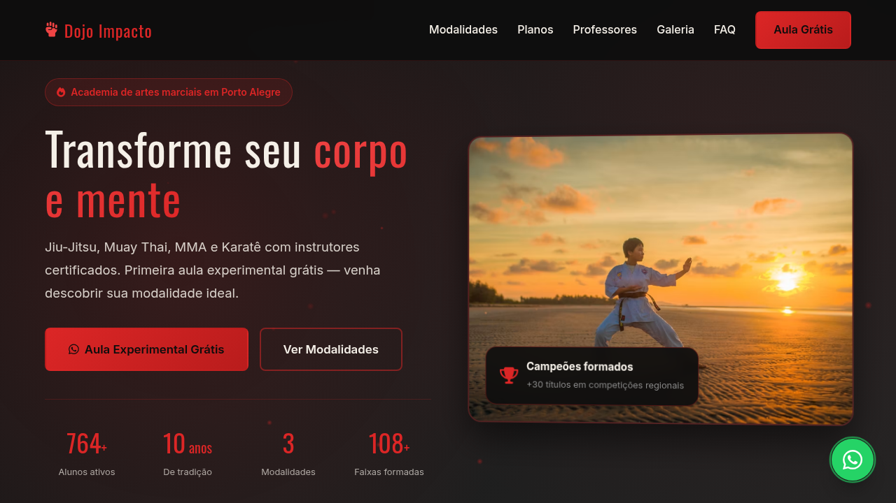
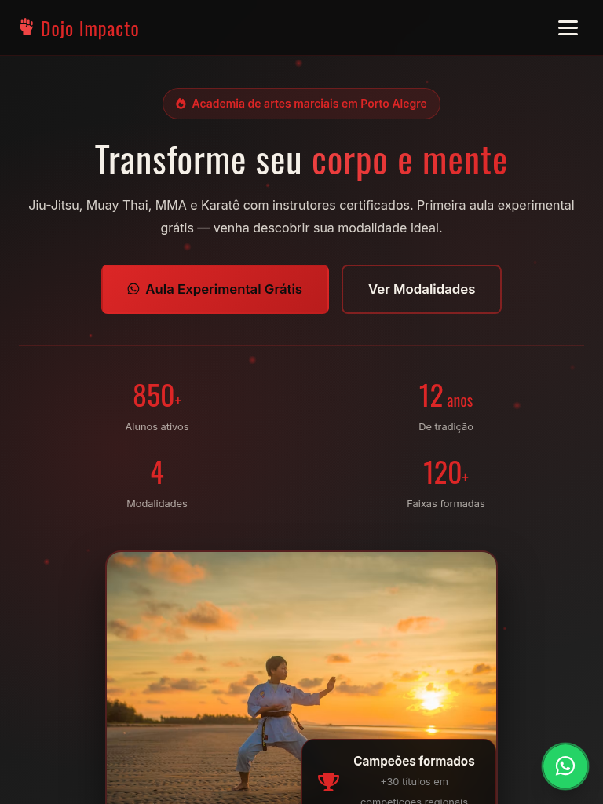
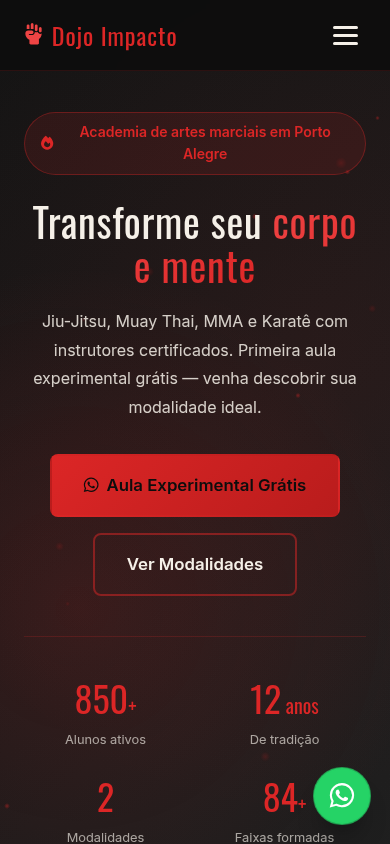

# Dojo Impacto — Academia de Artes Marciais

Landing page de alta conversão para academia de artes marciais fictícia, desenvolvida com foco em responsividade, acessibilidade e integração WhatsApp.

[](https://tofariasti.github.io/landing-lutas/)

## Demo

**Moldura (preview):** [https://tofariasti.github.io/landing-lutas/](https://tofariasti.github.io/landing-lutas/)

**Tela cheia:** [https://tofariasti.github.io/landing-lutas/site/](https://tofariasti.github.io/landing-lutas/site/)

## Screenshots

### Desktop (1280px)


### Tablet (768px)


### Mobile (390px)


## Funcionalidades

- Design responsivo (mobile-first) com identidade preto e vermelho
- Integração WhatsApp com formulário estruturado para aula experimental
- Animações ao scroll (AOS) + partículas, contadores, preloader e hover effects
- Acessibilidade WCAG 2.1 AA (skip link, ARIA, foco visível, reduced motion)
- SEO básico (meta description, HTML semântico)
- Botão flutuante WhatsApp com pulse
- FAQ accordion interativo
- Galeria com lazy loading
- Moldura iframe com preview desktop/tablet/mobile

## Seções

1. **Hero** — Headline, CTAs, estatísticas animadas e imagem impactante
2. **Modalidades** — Jiu-Jitsu, Muay Thai, MMA e Karatê com benefícios
3. **Como funciona** — 3 passos da aula experimental à matrícula
4. **Planos** — Mensal, trimestral e anual com destaque no intermediário
5. **Professores** — 4 instrutores com faixa/grau e especialidade
6. **Galeria** — 8 fotos de treinos, tatame e competições
7. **Depoimentos** — 3 avaliações com estrelas
8. **CTA** — Seção de conversão intermediária
9. **FAQ** — Horários, equipamentos, idade mínima e cancelamento
10. **Contato** — Formulário WhatsApp para agendamento
11. **Footer** — Endereço, horários, redes e créditos

## Tecnologias

- HTML5 semântico
- CSS3 (Flexbox/Grid, custom properties)
- JavaScript vanilla (ES6+)
- AOS (Animate On Scroll) v2.3.4
- Font Awesome 6.4
- Google Fonts (Oswald + Inter)

## Testes de Responsividade

| Dispositivo | Resolução | Status |
|-------------|-----------|--------|
| iPhone SE | 375×667 | ✅ |
| iPhone 12 Pro | 390×844 | ✅ |
| iPhone 14 Pro Max | 428×926 | ✅ |
| iPad | 768×1024 | ✅ |
| iPad Pro | 1024×1366 | ✅ |
| Desktop HD | 1280×720 | ✅ |
| Desktop FHD | 1920×1080 | ✅ |

## Acessibilidade

- Semântica HTML5 adequada (`header`, `nav`, `main`, `section`, `footer`)
- Atributos ARIA quando necessário (`aria-expanded`, `aria-label`)
- Contraste WCAG AA (texto vermelho/claro sobre fundo escuro validado)
- Navegação por teclado (Escape fecha menu)
- Focus states visíveis em todos os interativos
- Alt text em imagens
- Labels associados a inputs
- Font-size mínimo 16px no mobile
- Skip link para conteúdo principal
- Respeita `prefers-reduced-motion`

## Como usar

```bash
git clone https://github.com/tofariasti/landing-lutas.git
cd landing-lutas
# Abrir index.html no navegador (preview com moldura iframe)
# Ou abrir site/index.html para tela cheia
python3 -m http.server 8080
```

## Personalização

1. **WhatsApp:** altere `WHATSAPP_NUMBER` em `site/assets/js/main.js`
2. **Cores:** edite as variáveis CSS em `:root` no `site/assets/css/style.css`
3. **Textos e modalidades:** edite `site/index.html`

## Estrutura

```
lutas/
├── index.html              # Preview shell (moldura iframe)
├── assets/css/preview.css
├── assets/js/preview.js
├── site/
│   ├── index.html          # Landing page
│   └── assets/
│       ├── css/style.css
│       └── js/main.js
├── screenshots/
├── scripts/
│   ├── capture-screenshots.mjs
│   └── test-responsive.mjs
├── .github/workflows/deploy.yml
└── README.md
```

## Autor

**Tiago O. de Farias** — [Farias Digital](https://fariasdigital.com.br/)

- GitHub: [@tofariasti](https://github.com/tofariasti)
- WhatsApp: [(51) 99121-3724](https://wa.me/5551991213724)

---

<p align="center">
  <a href="https://tofariasti.github.io/landing-lutas/">🌐 Demo Online</a> ·
  <a href="https://fariasdigital.com.br/">🏢 Site Comercial</a>
</p>
